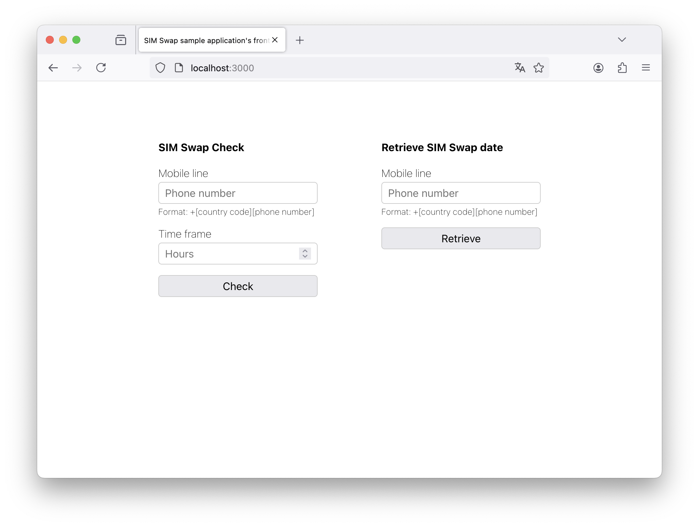

# SIM Swap sample application's frontend

This is a convenience frontend for the SIM Swap sample application. It is a simple web application that allows you to interact with the SIM Swap sample application for testing and demoing purposes, although it is not the common use case to use the Open Gateway SIM Swap API from a frontend application.

Be sure to check the [SIM Swap sample backend application](https://github.com/Telefonica/opengateway-samples-simswap-backend) for more information.

## Requirements

This frontend application is built using React.js. You need to have Node.js installed in your system to install dependencies and run it, apart from Git to clone the repository as the first step:
- [Git](https://git-scm.com/downloads)
- [Node.js](https://nodejs.org/)

Once you have Node.js installed and have cloned this repository, you can run the following command from the the root directory to install the dependencies:

```Shell
npm install
```

## Configuration

In order the make your sample app running connected to the [SIM Swap sample backend application](https://github.com/Telefonica/opengateway-samples-simswap-backend) you need to edit [App.js](./src/App.js) and change the `BACKEND_URL` constant to the URL where the backend application is running.

```Node
const BACKEND_URL = 'http://localhost:8000'
```
*Default PORT value on the sample backend server is `8000`. Be sure to update your server URL if you changed the default value on the backend application.*

## Running the application

React.js applications run on port `3000` by default. To run the application, execute the following command from the repository's root directory:

```Shell
npm start
```

The application should open on your browser automatically. Even if it doesn't, it will be available at `http://localhost:3000`.


